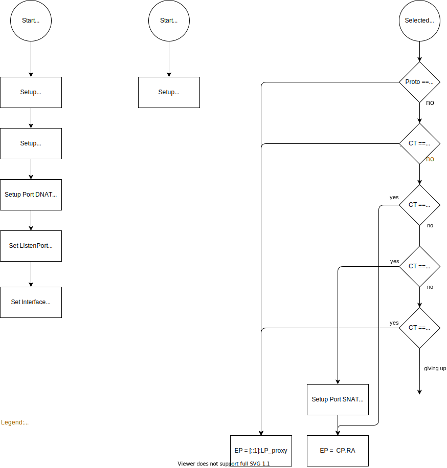

# Proxying

ɯice implements multiple ways of running an ICE agent alongside Wireguard on the same UDP ports.

## Kernel Wireguard module

### User-space

For each WG peer a new local UDP socket is opened.
ɯice will update the endpoint address of the peer to this the local address of the new sockets.

Wireguard traffic is proxied by ɯice between the local UDP and the ICE socket.

### RAW Sockets + BPF filter (Kernel)

We allocate a single [Linux RAW socket][raw-sockets] and assign a [eBPF][golang-bpf] filter to this socket which will only match STUN traffic to a specific UDP port.
UDP headers are parsed/produced by ɯice.
ɯice uses a UDPMux to mux all peers ICE Agents over this single RAW socket. 

### NFtables port-redirection (Kernel)

Two [Nftables][nftables] (nft) rules are added to filter input & output chains respectively.
The input rule will match all non-STUN traffic directed at the local port of the ICE candidate and rewrites the UDP destination port to the local listen port of the Wireguard interface.
The output rule will mach all traffic originating from the listen port of the WG interface and directed to the port of the remote candidate and rewrites the source port to the port of the local ICE candidate.  

Wireguard traffic passes only through the Netfilter chains and remains inside the kernel.
Only STUN binding requests are passed to ɯice.

```bash
$ sudo nft list ruleset
table inet wice {
    chain ingress {
        type filter hook input priority raw; policy accept;
        udp dport 37281 @th,96,32 != 554869826 notrack udp dport set 1001
    }

    chain egress {
        type filter hook output priority raw; policy accept;
        udp sport 1001 udp dport 38767 notrack udp sport set 37281
    }
}
```

## IPTables port-redirection

Similar to NFTables port-natting by using the legacy IPTables API.

## User-space Wireguard implementation

### User-space Proxy

Just like for the Kernel Wireguard module, a dedicated UDP socket for each WG peer is created.
ɯice will update the endpoint address of the peer to this the local address of the new sockets.

Wireguard traffic is proxied by ɯice between the local UDP and the ICE socket.

### In-process socket

ɯice implements wireguard-go's `conn.Bind` interface to handle Wireguard's network IO.

Wireguard traffic is passed directly between `conn.Bind` and Pion's `ice.Conn`.
No round-trip through the kernel stack is required.

**Note:** This variant only works for the compiled-in version of wireguard-go in ɯice.

## Flowchart



[nftables]: https://www.netfilter.org/projects/nftables/manpage.html

[golang-bpf]: https://riyazali.net/posts/berkeley-packet-filter-in-golang/

[raw-sockets]: https://squidarth.com/networking/systems/rc/2018/05/28/using-raw-sockets.html
